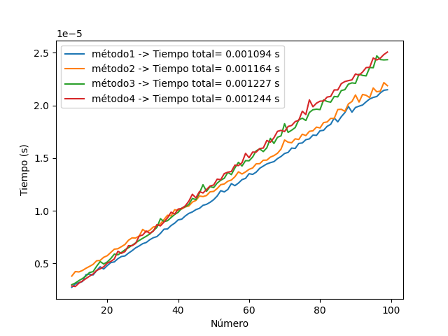
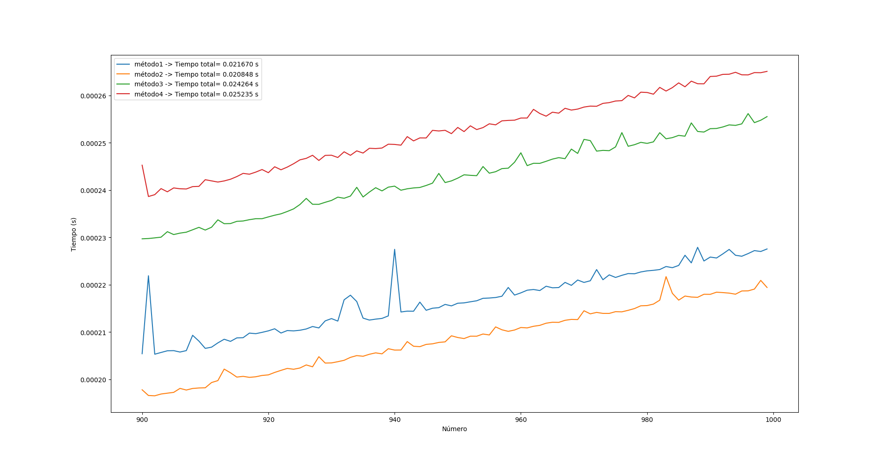

# Proyecto Euler 
## Por: **Effe** / *Jhonny Zapata*

---

El presente repositorio contiene la solución a los ejercicios propuestos en *Project Euler* que como reto personal me he propuesto solucionar en los lenguajes de programación:

1. Python
2. C++
3. Julia
4. Rust
5. JavaScript

El objetivo es optimizar el código en cada lenguaje y de esta manera profundizar en las funcionalidades y potencialidades de los mismos. Los primeros cuatro lenguajes están ordenados en cuanto a tiempo que llevo trabajando con ellos, siendo Python en el que más experiencia tengo y Rust el que al momento de escribir estas lineas no poseo experiencia. Además he decidido incluir Javascript a la lista entendiendo que si bien los procesos realizados no son frecuentes en el desarrollo web, creo pueden tener utilidad en algunos proyectos como juegos o animaciones.

Además de presentar las soluciones también se van a ir anexando comparaciones respecto a tiempo de ejecución entre lenguajes y en algunos casos comparaciones dentro del mismo lenguaje utilizando diferentes estructuras.

---

### Ejemplo ilustrativo

El primer problema del Proyecto Euler plantea la siguiente situación:

>Si listamos todos los números naturales menores que 10 que son mùltimos de 3 o de 5, tenemos 3,5,6 y 9. La suma de esos múltiplos es 23.
>
>Encontrar la suma de todos los múltiplos de 3 o de 5 menores que 1000.

**Nota:** Primero se plantea un enfoque básico (fuerza bruta), después de este uno más adecuado para la situación.

#### Enfoque básico:

Utilizando un ciclo for en Python se tiene:

```python
suma = 0
for i in range(1000):
    if (i%3==0 or i%5==0):
        suma+=i
print(suma)
```

Otro enfoque podría ser:

```python
lista = [i for i in range(1000) if (i%3==0 or i%5==0)]
print(sum(lista))
```

La cuestión que he intentado plantearme es comparar el rendimiento de cada 'método', por lo que en algunos casos realizaré las comparaciones de dichas 'métodos', como en el siguiente código donde he agregado otras 'métodos' :

```python
import timeit as tm
import matplotlib.pyplot as plt

def metodo1(num): #Enfoque tradicional
    suma = 0
    for i in range(num):
        if (i%3==0 or i%5==0):
            suma+=i
    return suma

def metodo2(num): #Uso de lista comprimida
    lista = [i for i in range(num) if (i%3==0 or i%5==0)]
    return sum(lista)

def metodo3(num): #Similar al enfoque tradicional pero con condicional en una sola linea
    val=0
    for i in range(num):
        val+=i if (i%3==0 or i%5==0) else 0
    return val

def metodo4(num): #Utilizando el ciclo while
    val=0
    k=1
    while k<num:
        if (k%3==0 or k%5==0):
            val+=k
        k+=1
    return val

def prueba(funcion, num):
    return tm.timeit(lambda: funcion(num), number=100)/100

x = range(10,100)
metodos = [metodo1, metodo2, metodo3, metodo4]

tiempos = [[prueba(metodo, val) for val in x] for metodo in metodos]

for idx, elm in enumerate(tiempos):
    tiempo=sum(elm)
    plt.plot(x,elm, label=f'método{idx+1} -> Tiempo total= {tiempo:.6f} s')

plt.xlabel('Número')
plt.ylabel('Tiempo (s)')
plt.legend()
plt.show()
```

El resultado obtenido fue el siguiente:



En el que se observa un comportamiento similar, sin embargo evaluando en un rango con valores mayores, como entre 900 y 1000, las diferencias se hacen más notables.



De esta forma intento observar el comportamiento de las "métodos" de Python y así comprender un poco mejor.


#### Enfoque serio

Debido a la naturaleza del problema planteado, todas los planteamientos anteriores son inadecuados. Realmente es más sencillo desde un enfoque matemático, ya que se puede abordar de la siguiente manera:

**Suma de múltiplos de 3**
La suma de los múltiplos de 3 menores que 1000 tiene k términos, siendo $k=\lfloor \frac{1000}{3} \rfloor $, donde $ \lfloor \dotsb \rfloor$ es la función piso.
$$ S_3 = \sum_{i=1}^{k} 3 \cdot i = 3 \sum_{i=1}^{k} i = 3 \frac{k \cdot (k+1)}{2} $$

**Suma de múltiplos de 5**
La suma de los múltiplos de 5 menores que 1000 tiene q términos, siendo $q=\lfloor \frac{1000}{5} \rfloor-1$, se le resta 1 ya que 1000 es múltiplo de 5 y se pide la suma de los menores a 1000, por lo que no está incluido el 1000.

$$ S_5 \sum_{i=1}^{q} 5 \cdot i = 5 \sum_{i=1}^{q} i = 3 \frac{q \cdot (q+1)}{2} $$

**Múltiplos de 3 y 5**
Si se suman directamente los dos valores anteriores se cometería el error de sumar dos veces los números que son múltiplos de 3 y de 5, es decir los múltiplos de 15 (el mínimo común múltiplo de 3 y 5). Por lo que para obtener el resultado real se debe hacer lo siguiente:
$$ S_T = S_3+S_5-S_15$$
Donde $S_15$ está definida como:
$$ S_15 \sum_{i=1}^{r} 15 \cdot i = 15 \sum_{i=1}^{r} i = 15 \frac{r \cdot (r+1)}{2} $$
con $r=\lfloor \frac{1000}{15} \rfloor $.

Ahora, con el ánimo de generalizar la situación, es decir dar solución al problema dados dos enteros para sumar sus múltiplos con una cota superior el código en pyhon sería:

```python
def sumatorio(n,a):
    if n%a==0:
        return int(a*(n//a-1)*(n//a)/2)
    else:
        return int(a*(n//a)*(n//a+1)/2)

def max_Com_Div(a,b):
    if b==0:
        return a
    return max_Com_Div(b,a%b)

def min_com_mul(a,b):
    
    return int(a*b/max_Com_Div(a,b))

def P1(n,a,b):
    return sumatorio(n,a)+sumatorio(n,b)-sumatorio(n,min_com_mul(a,b))

print(P1(1000,3,5))
#Answer: 233168
```

